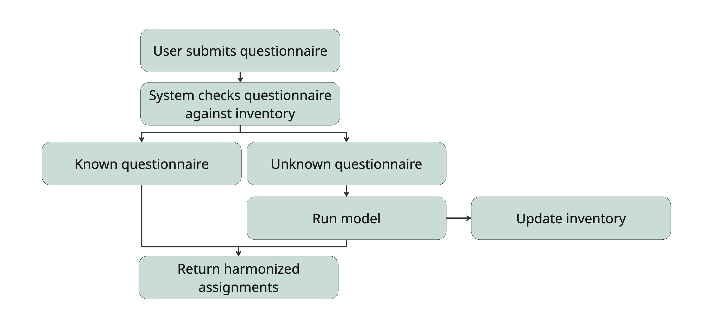

# HarmoniCA - Harmonizing Clinical Assessments

## Background

Diversity in the design of clinical assessment instruments creates fundamental incompatibilities when attempting to use them in a retrospective collaborative research setting (retrospective multi-site consortia, machine learning analyses, federated learning settings etc.). Previous harmonization approaches for questionnaire data have primarily relied on psychometric linking methods such as Item Response Theory (IRT) or Principal Component Analysis (PCA). While valuable, these methods require overlapping response data between questionnaires, which is often unavailable in retrospective multi-site analyses.

## Functionality of the tool

This tool offers mapping of individual questionnaire items from multiple instruments to pre-defined symptom dimensions. Dimension scores are subsequently transformed to allow comparability across different clinical instruments.

## Research

Symptom dimensions were chosen based on the convergence of evidence across original scale publications, validation studies, expert recommendations, diagnostic manuals, and neuroimaging applications, along with practical considerations regarding dimension homogeneity and sample characteristics. Clinicians and researchers assigned items to dimensions through a structured survey. Through semantic similarity analysis using different embedding models and computation of embeddings for both questionnaire items and dimension descriptions, the best performing embedding model for each construct was chosen based on maximum cosine similarity between item and to dimension description embeddings (mirroring the expert task). The best performing model for each construct was fine-tuned with the probability distribution of the expert mappings using contrastive learning.

## Results

Cross validation results:

| Construct| Folds | Mean accuracy| SD |
|-----------|----------|-----------|----------|
| Depression | 14 | 86.9% | ±11.9% |
| Anxiety | 13 | 93.7% | ±10.7% |
| Sleep | 17 | 93.4% | ±12.1% |
| Apathy | 11 | 77.9% | ±25.0% |

## Final models

All fine-tuned models can be found on [Huggingface](https://hf.co/collections/julia-pfarr/harmonica)